# Public Health Disease Monitoring System

## 📌 Overview
A Public Health Monitoring system that visualizes disease-affected zones on a map and automates urgent health actions using severity-based logic and workflow automation.

## 🎯 Problem Statement
During disease outbreaks, authorities need a real-time view of affected zones and a system to prioritize high-severity areas for quick action.

## ✅ Key Features
- Disease zone records with geolocation (Latitude/Longitude)
- Map visualization using LWC lightning-map with marker list
- Severity-based marker indication (🟢🟡🔴)
- Record-Triggered Flow to auto-create urgent Tasks for high severity zones
- Formula field to calculate Severity Score automatically
- Reports & Dashboard for analytics and decision-making

## 🛠 Tech Stack
- Platform: Salesforce
- Frontend: LWC (Lightning Web Components)
- Backend: Apex (OOP)
- Database: SOQL
- Automation: Record-Triggered Flows
- Analytics: Reports & Dashboards

## 📌 Custom Object
- Disease_Area__c

### Key Fields
- Disease_Name__c (Picklist)
- Risk_Level__c (Picklist)
- Active_Cases__c (Number)
- Severity_Score__c (Formula)
- Location__c (Geolocation)
- Last_Reported__c (Date)

## 🧠 Automation
### Flow: High Severity Task Automation
- Trigger: On Disease Area record create/update
- Condition: Severity Score >= 4
- Action: Create Task  
  Subject: Immediate Health Action Required

## 🗺️ LWC Map Feature
Implemented an interactive monitoring map using Lightning Web Components.
All records with geolocation automatically appear as markers.

## 🧠 Software Engineering Highlights
- Designed a clean data model for disease zone monitoring
- Built a component-based map dashboard (LWC)
- Implemented backend service layer using Apex
- Applied severity-based prioritization logic (formula field)
- Automated urgent action using event-driven workflow (Flow → Task creation)

## 🔑 Core Concepts Used
- OOP and backend logic
- CRUD operations
- Data modelling
- Automation workflows
- Map-based visualization
- Analytics & reporting

## 📸 Screenshots

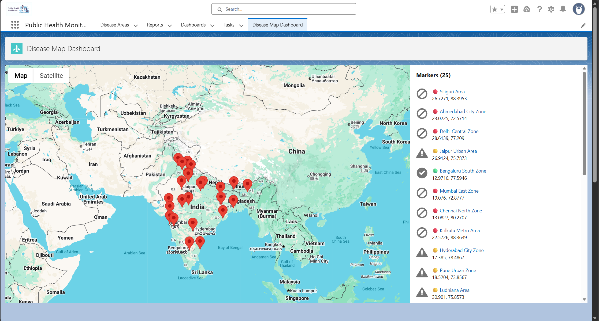
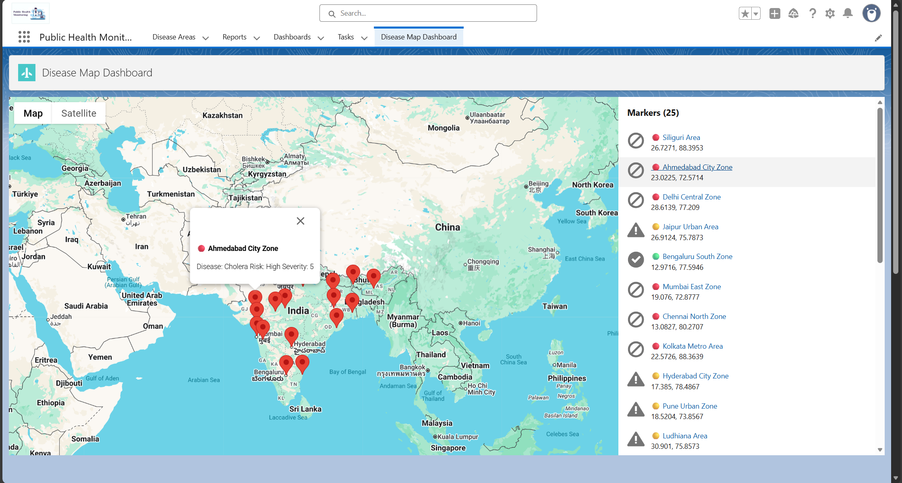

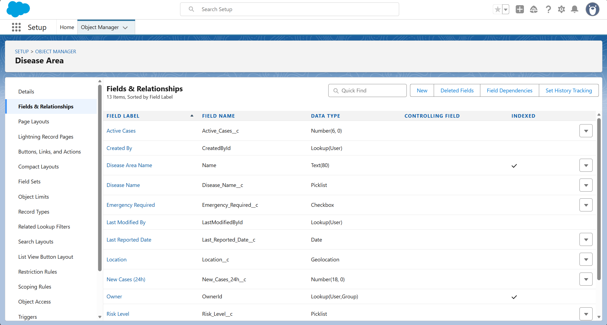
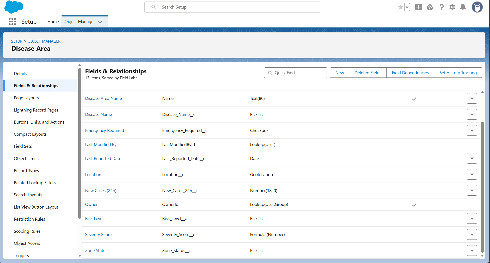

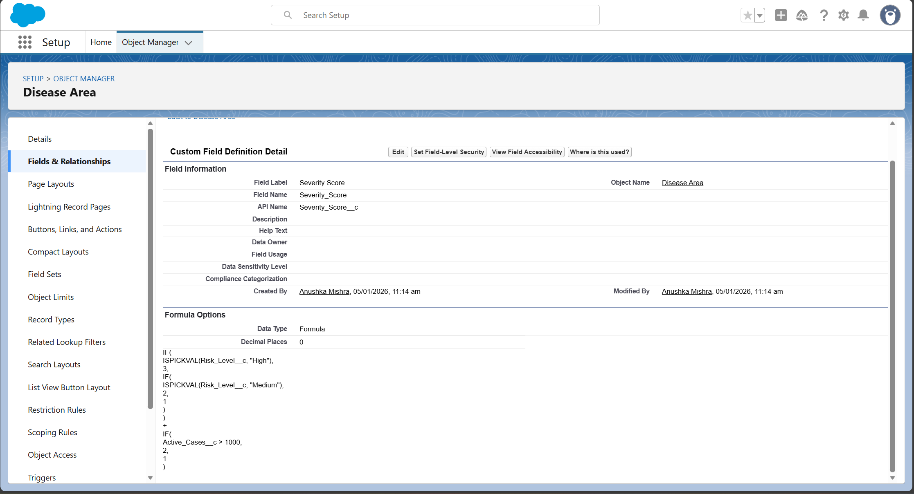

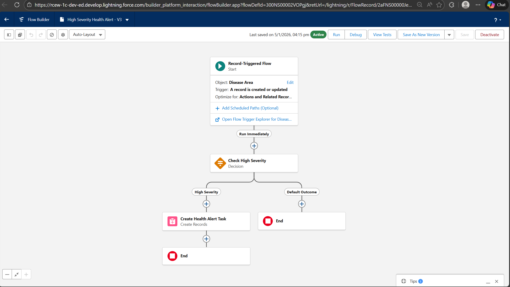
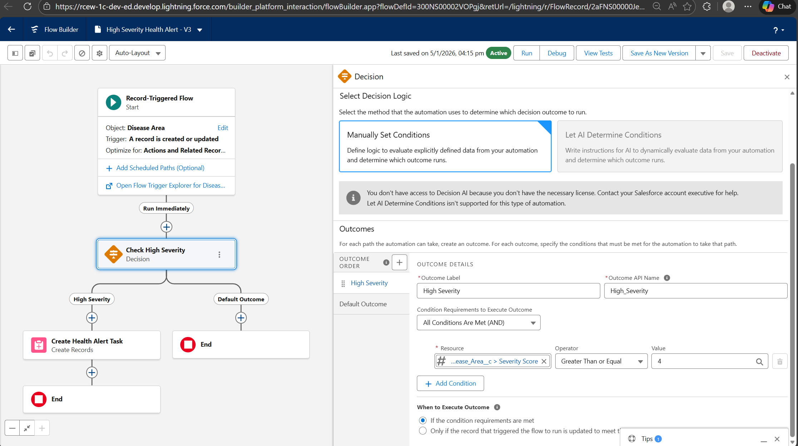

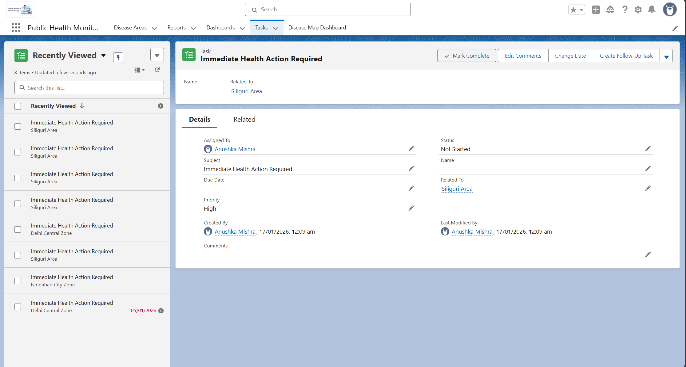
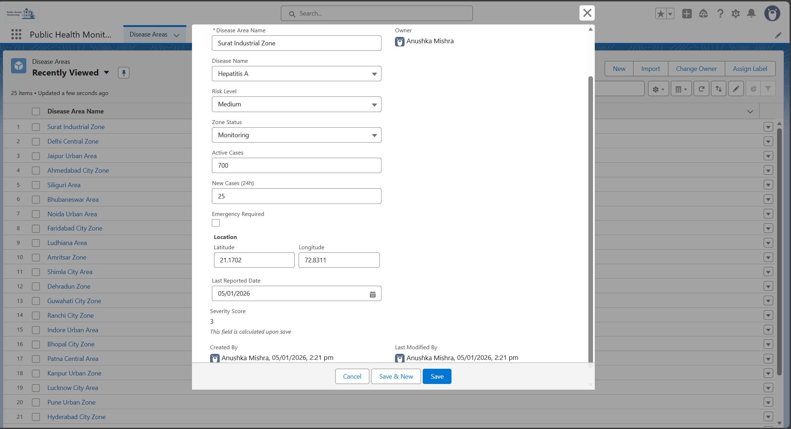

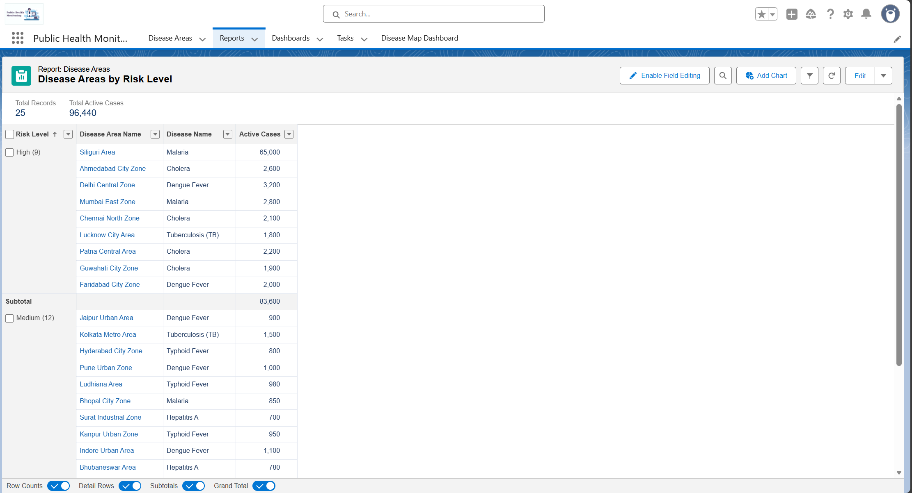
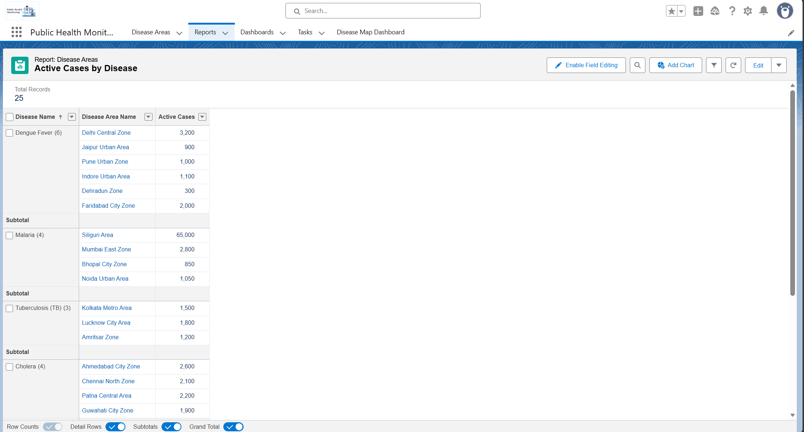
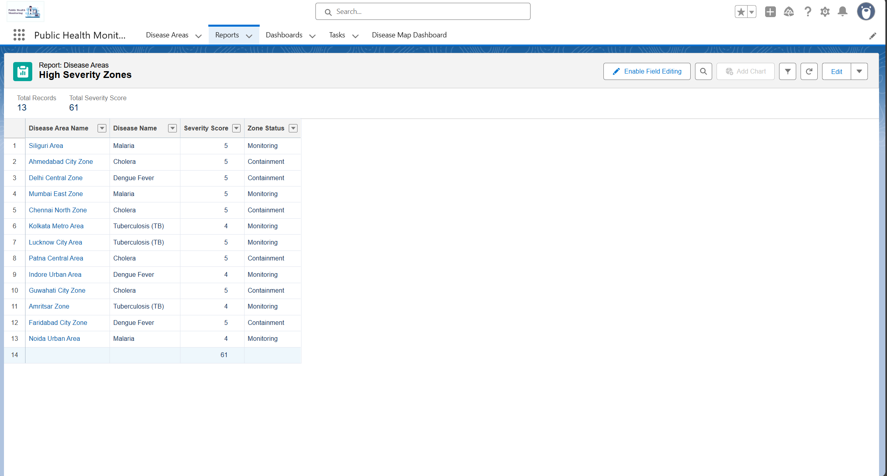

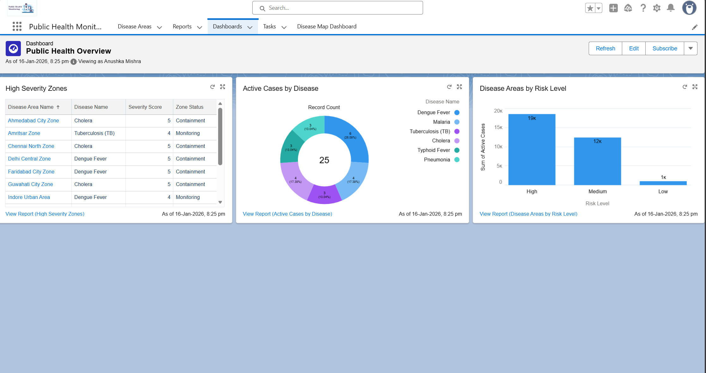

## 🚀 What I Learned
- Designing a real-world monitoring system with clear data modelling
- Building component-based UI dashboards with map visualization
- Implementing backend service logic using OOP principles
- Automating workflows using event-driven triggers (rules/flows)
- Writing efficient queries for retrieving location-based data
- Creating analytics using reports and dashboards for decision making
- Implemented the complete solution on Salesforce using LWC, Apex and Flows

